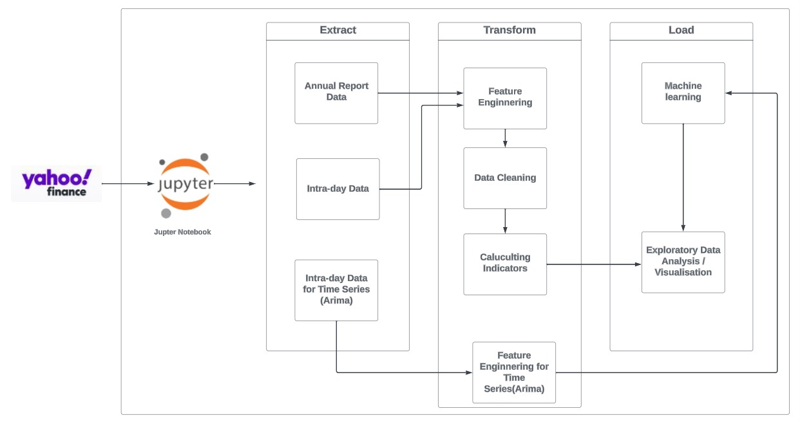

## 📍 Wichita, Kansas

📞 [Phone: +1-3162235472](tel:+1-3162235472)  ✉️ [Email: maheedhar.attaluri@outlook.com](mailto:maheedhar.attaluri@outlook.com)

🔗 [LinkedIn: Maheedhar Attaluri](https://www.linkedin.com/in/maheedhar-attaluri-6136b51ab/)  👨‍💻 [GitHub: MaheedharAttaluri](https://github.com/MaheedharAttaluri)

## 🗂️ Projects
[**Spotify Data pipeline (ETL)**](https://github.com/MaheedharAttaluri/Spotify-ETL.git)

**Tech Stack:** Python, AWS (Lambda, Cloud watch, S3, Trigger, Crawler, Glue, Athena)

•	Extracted Spotify API data using Python and automated extraction to AWS Lambda for efficient processing and storage

•	Configured AWS Lambda with triggers set to execute every one-minute, channelling new data to an S3 bucket for uninterrupted data ingestion

•	Initiated data transformation with S3 triggers and Lambda to sort data into designated bucket folders

•	Enabled an AWS Glue crawler to update the Glue Data Catalog automatically, allowing for sophisticated querying in Amazon Athena

[**E-Commerce Data Modelling and Analytics**](https://github.com/MaheedharAttaluri/Instakart-Data-Analysis)

**Tech Stack:** PostgreSQL, Python

•	Performed exploratory data analysis on the Instacart dataset using Python, to understand consumer purchase patterns

•	Developed an E-commerce data model and established a PostgreSQL database to streamline analytics

•	Generated PostgreSQL tables with Python queries, streamlining data insertion using psycopg2 and sqlalchemy packages

•	Executed Analytic Queries in PostgreSQL to extract key insights on order frequencies, product popularity, and temporal shopping patterns

[**YouTube Trending Video Dataset Visualization**](https://github.com/MaheedharAttaluri/YouTube-Treanding-Video-Analytics-)

**Tech Stack: Microsoft PowerBI**

•	Developed an interactive Power BI dashboard to visualize global YouTube trending video data, integrating slicers and varied visualizations to provide in-depth, 
  exploration of key viewership metrics

•	Applied DAX queries within Power BI for in-depth analysis of YouTube video trends, focusing on detailed user engagement and viewership dynamics

[**Labor Market & GDP predictions**](https://github.com/MaheedharAttaluri/Labor-Market-GDP-Prediction) 

**Tech Stack:** Python, Machine Learning models

•	Analysed FRED API data using Python and machine learning, identifying Consumer Price Index (CPI) as key influence in consumer spending to enhance economic forecasting

•	Applied Principal Component Analysis and time series analysis to enhance the accuracy and robustness of models predicting labor market and GDP trends.

[**Stock-Market-Prediction**](https://github.com/MaheedharAttaluri/Stock-Market-Prediction)

**Tech Stack:** Python, Jupyter Notebook, AWS Cloud Architecture 

•	Automated ETL pipeline capable of handling dynamic inputs, reduced manual data processing time by 70% and streamlining financial metric calculations.

•	Developed a Timeseries model which achieved prediction accuracy within 5% error margin of actual stock prices for the initial 5-day forecast period.

•	Proposed cloud-based architecture enhanced data processing scalability by 80% and reduced latency by 40%, using AWS services.

[**Live-Data-Analysis-using-Kafka**](https://github.com/MaheedharAttaluri/Live-Data-Analysis-using-Kafka)

**Tech Stack:** Python,Kafka, AWS (EC2, S3, Crawler, Glue, Athena)

•	Stock prices are extracted in real-time using the Finhub API and streamed into Kafka. A custom Python script functions as a producer, efficiently 
  pushing the data into Kafka topics.

•	The data flow is managed by Kafka, supported by ZooKeeper, ensuring robust data handling. Both Kafka broker and ZooKeeper are hosted on AWS EC2 
  instances to effectively manage the processing load.

•	After processing, the data is stored in AWS S3, providing a scalable and secure storage solution that acts as a data lake for further processing 
  and analysis.

•	AWS Glue catalogs the data in S3, creating searchable metadata and schemas. This structured data is then queried using Amazon Athena, allowing for 
  advanced SQL-based analysis directly from the data lake.

## 🎓 Educational Career

### M.Sc. Engineering Management - Major: Data Analytics - Wichita State University, USA January 2023 – May 2024

Focus: Machine Learning, Big Data Analytics, Applied Data Science

### M.Sc. Metallic Materials Technology - TU Bergakademie Freiberg, Germany (April 2019 – November 2022)

Focus: Additive Manufacturing, Project Management, Operations Management

### B.TECH. Mechanical engineering - Jawaharlal Nehru Technological University, India (August 2014 - April 2018)  

Focus:  Industrial Management, Manufacturing Automation, Process Design

